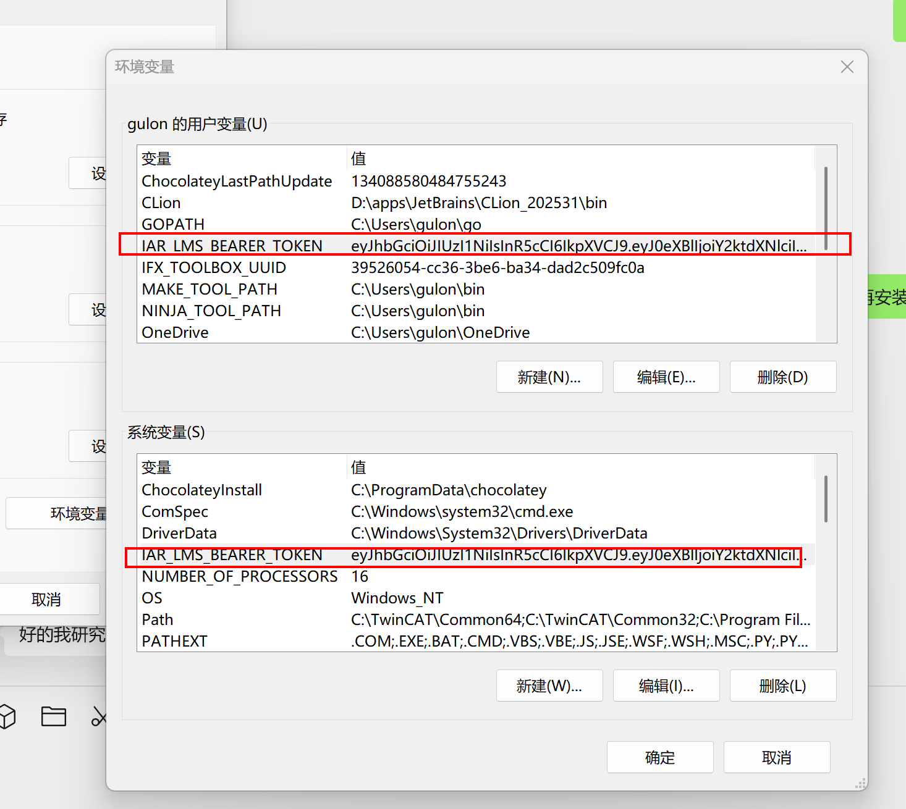

# IAR_RH850安装

所有下载链接

**Download links**

EWC: [https://netstorage.iar.com/FileStore/STANDARD/001/004/074/ewrh850c-3.20.1.2142.exe](https://netstorage.iar.com/FileStore/STANDARD/001/004/074/ewrh850c-3.20.1.2142.exe)

EW: [https://netstorage.iar.com/FileStore/STANDARD/001/004/072/ewrh850-3.20.1.2142.exe](https://netstorage.iar.com/FileStore/STANDARD/001/004/072/ewrh850-3.20.1.2142.exe)

CX-Win: [https://netstorage.iar.com/FileStore/STANDARD/001/004/083/cxrh850-3.20.1.2142.exe](https://netstorage.iar.com/FileStore/STANDARD/001/004/083/cxrh850-3.20.1.2142.exe)

CX-Ubuntu: [https://netstorage.iar.com/FileStore/STANDARD/001/004/084/cxrh850-3.20.1.deb](https://netstorage.iar.com/FileStore/STANDARD/001/004/084/cxrh850-3.20.1.deb)

CX Red Hat: [https://netstorage.iar.com/FileStore/STANDARD/001/004/085/cxrh850-3.20.1-3.20.1-1.x86_64.rpm](https://netstorage.iar.com/FileStore/STANDARD/001/004/085/cxrh850-3.20.1-3.20.1-1.x86_64.rpm)

# 1.先安装license manager

```powershell
[https://updates.iar.com/?product=LMSCDAEMON](https://updates.iar.com/?product=LMSCDAEMON)
```

# 2.设置好环境变量

IAR_LMS_BEARER_TOKEN

eyJ……（这里填lisence）



# 3.下载并安装IAR_EWRH850C

```powershell
https://updates.iar.com/?product=EWRH850c
```

打开正常使用，忽略登录提醒