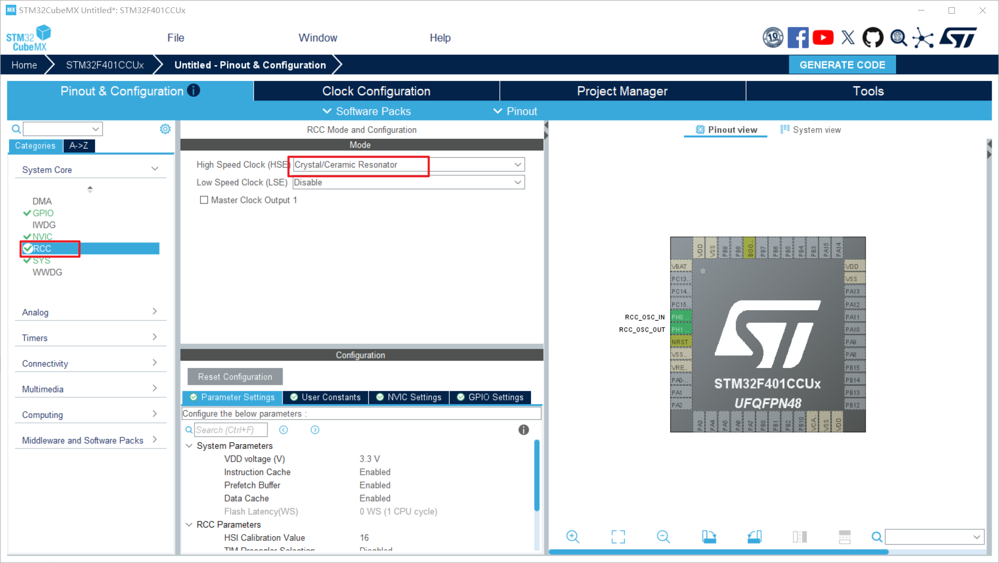

## 1. 选择时钟源



选择外部高速时钟源

## 2. 切换 HAL 库时基

FreeRTOS 的时基使用的是 Systick，而 STM32CubeMX 中默认的 HAL 库时基也是 Systick。为了避免可能的冲突，最好将 HAL 库的时基换做其它的硬件定时器。


Serial Wire (SWD - 串行线调试)，这是 ARM 专门为 Cortex 架构定制的调试协议。

**占用引脚：** 仅需 **2个** 信号引脚（`SWDIO` 数据线、`SWCLK` 时钟线），加上 VCC 和 GND，通常一个 4-pin 排针就能搞定。

JTAG (4-pin / 5-pin)：JTAG 是一个国际标准的测试和调试接口协议。

**占用引脚：** 至少需要 **4个** 引脚（`TDI`、`TDO`、`TCK`、`TMS`），有时还会带一个复位引脚 `TRST`（5-pin）。通用性极强，不仅支持 ARM，还支持 DSP、FPGA 等各种芯片。最大的杀手锏是**菊花链（Daisy-chaining）技术**。如果你的板子上有多个芯片（比如一个 STM32 加上一个 FPGA），你可以用一条 JTAG 链路把它们串起来，通过一个调试接口烧录和调试所有芯片；此外，它还支持边界扫描（Boundary Scan），常用于产线的硬件连通性测试。

## 3. 设置主频


## 4. 配置 FreeRTOS


使用 STM32CubeMX 时，有一个默认任务，此任务无法删除，只能修改其名称和函数类型。

### `MINIMAL_STACK_SIZE` (最小任务栈大小)

- **图中当前值：** 128 Words
- **解释：** 注意这里是 **Words (字)**。在 32 位的 ARM Cortex-M 架构上，128 Words 就是 512 Bytes。这主要用于 FreeRTOS 自动生成的**空闲任务 (Idle Task)** 和**定时器守护任务**。如果不打算往空闲任务钩子函数（Idle Hook）里写复杂的逻辑，128 完全够用。

### `USE_PREEMPTION` (使用抢占式调度)

- **图中当前值：** Enabled
- **解释：** 保持开启。只有开启抢占，高优先级的任务一旦就绪才能立刻打断正在运行的低优先级任务，这是实时操作系统 (RTOS) "实时性"的核心保证。

## 5. 配置工程


点击生成代码即可。

这里的最小堆栈，是**单片机裸机硬件级别的堆栈**（由启动文件 `.s` 分配）；而上一轮我们讨论的 `TOTAL_HEAP_SIZE`，是 **FreeRTOS 操作系统自己维护的软件级别的堆栈**。

### 1. Minimum Stack Size (系统最小栈大小)

**图中当前值：** `0x400` (1024 Bytes)

**底层原理：** 在 ARM Cortex-M 架构中，这个栈对应的是**主堆栈指针 (MSP, Main Stack Pointer)**。

**什么时候会用到它？**

1. **RTOS 启动前：** 从单片机上电执行 `Reset_Handler`，到跑完 `main()` 函数前半部分的硬件初始化，直到你调用 `osKernelStart()` 启动调度器之前，所有的局部变量都存在这里。
2. **中断服务函数 (ISR)：** **这是最关键的一点！** 在 FreeRTOS 运行后，各个任务有自己的私有栈（使用 **PSP**, 进程堆栈指针），但只要单片机一触发硬件中断（如串口接收、定时器中断），Cortex-M 硬件会**强制切换回 MSP** 执行中断服务函数。

**配置建议：** 保持 `0x400` 通常足够。但如果你的硬件中断里嵌套很深，或者在中断里定义了局部大数组，就需要把它调大，否则会发生栈溢出导致 HardFault。

### 2. Minimum Heap Size (系统最小堆大小)

**图中当前值：** `0x200` (512 Bytes)

**底层原理：** 这是给 C 语言标准库预留的内存区域。

**什么时候会用到它？**

只有当你在代码里显式调用了标准库的 `malloc()`、`calloc()`，或者使用了某些会隐式分配内存的 C 标准库函数（比如引入了复杂的 `printf` 浮点格式化）时，才会消耗这里的空间。

**配置建议：** 在正规的 FreeRTOS 项目中，为了防止内存碎片和线程安全问题，我们**强烈要求使用 FreeRTOS 提供的 `pvPortMalloc()`** 来代替标准 `malloc()`。因为你所有的任务、队列内存都是从上一轮配置的那 15KB (`TOTAL_HEAP_SIZE`) 里分配的，所以这个系统级别的 Heap 保持默认的 `0x200` 即可，有些极致优化的项目甚至会把它设为 `0`。

| **内存区域** | **存放内容** | **具体地址流向** | **在你当前配置下的情况** |
| --- | --- | --- | --- |
| **.data 段** | 赋予了初值的全局变量和静态变量。 | 低地址起，紧挨着基地址固定分配。 | 大小取决于你写的代码。 |
| **.bss 段** | 未赋初值（或初值为 0）的全局变量和静态变量。<br>⭐ **重点：FreeRTOS 的那 15KB 堆也在这里！** | 紧挨着 .data 段之上。 | `heap_4.c` 本质上是定义了一个 `static uint8_t ucHeap[15360]` 的巨大全局数组，所以它**完全属于 .bss 段**。 |
| **System Heap (系统堆)** | 供 C 标准库 `malloc()` 等动态分配使用的空间。 | 紧挨着 .bss 段的结尾，**向上生长**（向高地址方向）。 | 占用 512 Bytes (`0x200`)。 |
| **Free RAM (空闲内存)** | 尚未分配的剩余物理内存，充当堆和栈之间的安全缓冲区。 | 位于系统堆和系统栈之间。 | 剩余空间 = 64KB - (.data + .bss + 15KB + 0.5KB + 1KB)。一旦堆和栈越界相撞，系统就会崩溃。 |
| **System Stack (系统栈)** | `main()` 函数启动前的变量、以及**所有硬件中断 (ISR)** 使用的 MSP 栈。 | 从 SRAM 的最高地址 (`0x2001 0000`) 处，**向下生长**（向低地址方向）。 | 占用 1024 Bytes (`0x400`)。 |

## 6. 生成代码后，打开 Keil 直接编译

## 7. 修改默认任务为闪灯任务


```c
void StartDefaultTask(void *argument)
{
  /* USER CODE BEGIN StartDefaultTask */
  /* Infinite loop */
  for(;;)
  {
    HAL_GPIO_WritePin(GPIOC, GPIO_PIN_13, GPIO_PIN_RESET);
    osDelay(100);
    HAL_GPIO_WritePin(GPIOC, GPIO_PIN_13, GPIO_PIN_SET);
    osDelay(100);
  }
  /* USER CODE END StartDefaultTask */
}
```
